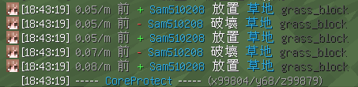

# ⬜ 雜項指令

## 概覽

| 指令      | 說明       |
| ------- | -------- |
| `/co i` | 檢視土地變更紀錄 |

## 格式說明

* `<玩家>`：必填參數，沒有填寫無法聊天喔
* `[玩家]`：選填參數，需要再填不要不用填

## 土地變更紀錄

### 啟動土地變更紀錄偵測器

啟動該偵測器後，使用者將無法放置與移除方塊。相對的，在你放置或移除方塊（左鍵或右鍵）點擊的位置的所有變更紀錄都會顯示在聊天欄中

> /co i

**範例指令**：`/co i`

**範例指令結果**：

<figure><figcaption>
某個位置的土地變更紀錄
</figcaption></figure>

